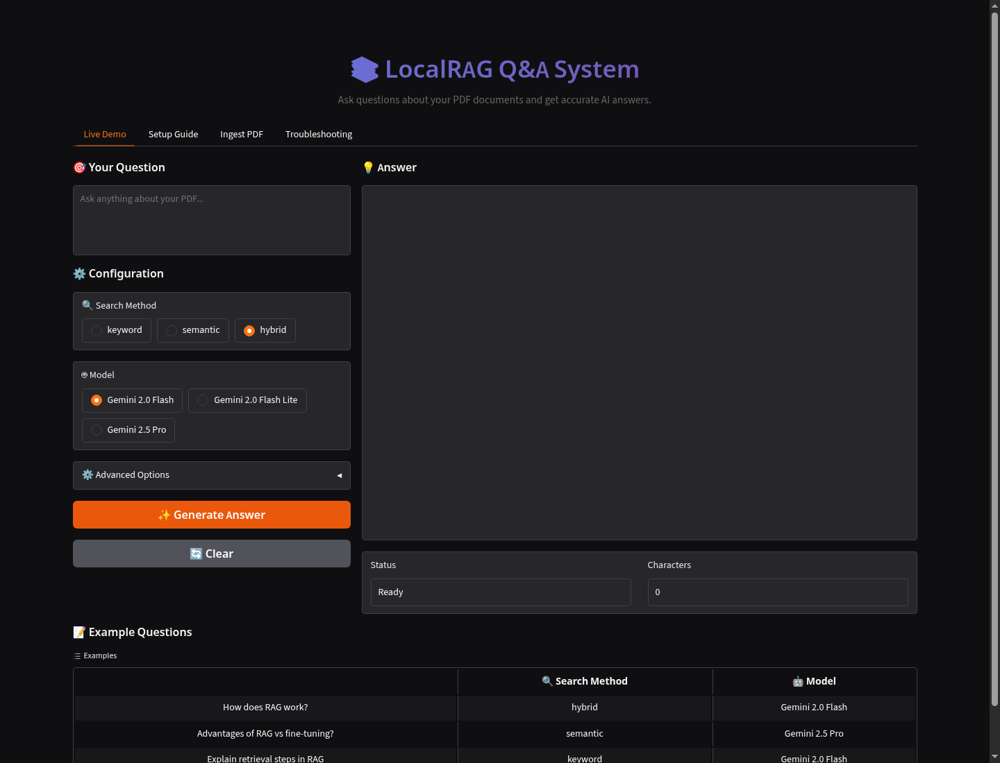

# Multimodal RAG Q&A System

A portfolio-ready Retrieval-Augmented Generation project for asking questions over PDF content. The system extracts text, tables, and image context from PDFs, indexes the chunks in OpenSearch with Ollama embeddings, and generates grounded answers with Gemini.



## What This Demonstrates

- PDF ingestion with text chunking, table handling, and optional image/table captioning.
- Dense vector search with `nomic-embed-text` embeddings served by Ollama.
- Keyword, semantic, and hybrid retrieval modes.
- Hybrid retrieval with rank fusion instead of a brittle single query.
- Lightweight reranking of retrieved candidates before generation.
- Grounded Gemini answer generation with retrieved source metadata.
- A Gradio UI for testing retrieval behavior and uploading PDFs interactively.
- Dockerized local infrastructure for OpenSearch and Ollama.

## Architecture

```text
PDF files
  -> unstructured PDF partitioning
  -> text/table/image chunks
  -> Ollama embeddings
  -> OpenSearch index
  -> keyword / semantic / hybrid retrieval
  -> Gemini response generation
  -> Gradio web UI
```

Gemini is used for answer generation and optional multimodal captioning, so this project is local-first but not fully offline.

## Project Structure

```text
app.py              Gradio application
main.py             CLI entry point for launching the app
check_setup.py      Environment and optional service validation
ingestion.py        PDF processing and OpenSearch indexing
chunking.py         Text, table, and image chunk preparation
retrieval.py        Keyword, semantic, and hybrid search
generation.py       Prompt construction and Gemini calls
helper.py           OpenSearch and Ollama utilities
docker-compose.yml  OpenSearch, OpenSearch Dashboards, and Ollama
.env.example        Configuration template
eval_examples.json  Small retrieval/answer evaluation examples
```

## Quick Start

1. Create a virtual environment and install dependencies.

```bash
python3 -m venv .venv
source .venv/bin/activate
pip install -r requirements.txt
```

On Windows, use:

```bat
run_windows.bat
```

2. Create your environment file.

```bash
cp .env.example .env
```

Set `GEMINI_API_KEY` in `.env`.

Validate local configuration without printing secrets:

```bash
python3 check_setup.py
python3 check_setup.py --services
```

If the project is installed with `pip install -e .`, the same check is available as:

```bash
localrag-check --services
```

3. Start local services.

```bash
docker compose up -d
docker exec ollama ollama pull nomic-embed-text
```

4. Ingest the sample PDF.

```bash
python3 ingestion.py
```

5. Launch the app.

```bash
python3 main.py
```

Open `http://localhost:7860`.

## Configuration

Common `.env` values:

```env
GEMINI_API_KEY=your_gemini_api_key_here
OPENSEARCH_HOST=localhost
OPENSEARCH_PORT=9200
OLLAMA_HOST=localhost
OLLAMA_PORT=11434
EMBEDDING_MODEL=nomic-embed-text
EMBEDDING_DIMENSION=768
INDEX_NAME=pdf_content_index
PDF_PATH=files/tani.pdf
RESET_INDEX=false
RERANK_RESULTS=true
```

Set `RESET_INDEX=true` when you intentionally want to rebuild the OpenSearch index from scratch.

## Retrieval Modes

- `keyword`: BM25-style lexical matching through OpenSearch.
- `semantic`: KNN vector search over Ollama embeddings.
- `hybrid`: runs keyword and semantic search separately, combines them with reciprocal-rank fusion, then reranks the final candidates.

Hybrid mode is the default because it handles exact terms and paraphrased questions better than either method alone.

## Evaluation Examples

`eval_examples.json` contains a small set of expected question/source/answer traits. These examples are intentionally lightweight so they can be used for manual review, future automated evaluation, or demo scripts.

Run retrieval-only evaluation:

```bash
python3 evaluate_examples.py
```

Run retrieval plus generated-answer checks:

```bash
python3 evaluate_examples.py --generate
```

If installed with `pip install -e .`, use:

```bash
localrag-evaluate --generate
```

## Tests

```bash
python3 -m unittest discover -s tests
```

The current tests cover prompt formatting, source metadata formatting, rendered citations, hybrid rank fusion, and deterministic reranking.

## Useful Checks

```bash
curl http://localhost:9200
curl http://localhost:11434/api/tags
curl http://localhost:9200/pdf_content_index/_count
python3 check_setup.py --services
python3 -m py_compile app.py chunking.py generation.py helper.py ingestion.py retrieval.py main.py
```

If `python` is not available on your system, use `python3`.

## Notes for Reviewers

The included sample file is `files/tani.pdf`. You can index a different PDF by setting `PDF_PATH` in `.env`.

The repository intentionally excludes `.env`, virtual environments, caches, and generated package metadata. Keep API keys out of GitHub.

## License

MIT. See `LICENSE`.
