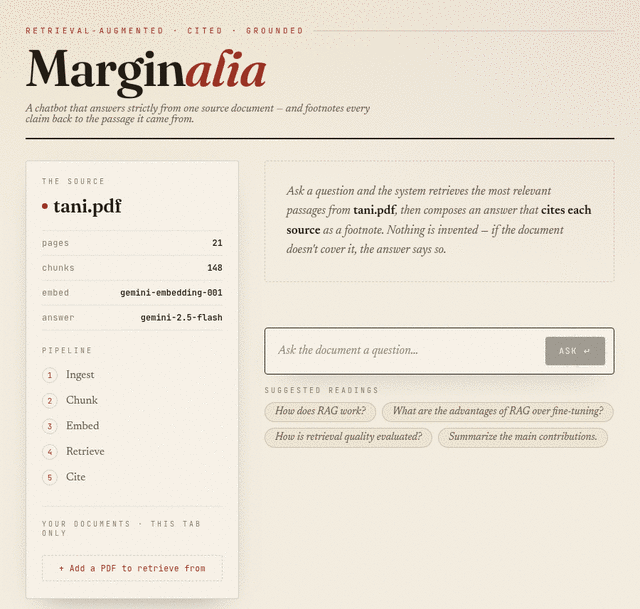

# Marginalia — RAG Q&A over a PDF

A document-grounded Q&A chatbot that answers **strictly from one source
document** and footnotes every claim back to the passage it came from.

**Live demo:** <https://multi-rag-system.vercel.app/>



The app lives in [`web/`](web/) — a serverless Next.js project deployed on
Vercel. It previously had a companion local version built on Gradio +
OpenSearch + Ollama; that stack has been removed since it's no longer what's
live (see [What's in the repo root](#whats-in-the-repo-root)).

## Architecture

```
Browser ──POST /api/chat──▶ Next.js route (Node serverless fn)
                              1. embed query   → gemini-embedding-001
                              2. cosine search → data/embeddings.json (in-memory)
                              3. build prompt  → grounded, "cite with [n]"
                              4. stream answer → gemini-2.5-flash  (NDJSON)
```

The response is NDJSON: a `meta` line with the retrieved sources, then `token`
lines streaming the answer, then `done`.

The document vectors are **precomputed once** and shipped in
`web/data/embeddings.json`, so the only runtime dependency is the Gemini API
— no vector database, no GPU host.

### Adding your own document (session-only)

The "+ Add a PDF to retrieve from" control in the sidebar lets a visitor add
a PDF on the spot: `/api/upload` extracts and chunks it the same way as
`build_embeddings.py`, embeds the chunks with Gemini, and returns them to the
browser. The browser holds them (`sessionStorage`, that tab only) and resends
them with each question, where `lib/rag.ts#search` merges them into the
cosine-similarity pool. Nothing is written server-side, so this needs no
database — capped at 4MB / 80 chunks / 100 pages per upload to stay within
Vercel's request-body limit and the function's `maxDuration`.

## Local development

```bash
cd web
npm install
echo "GEMINI_API_KEY=your_key_here" > .env.local
npm run dev   # http://localhost:3000
```

## Deploy on Vercel (GitHub import)

1. Push this repo to GitHub (already done if you're reading this on GitHub).
2. Go to <https://vercel.com/new> and **Import** the `Multi_Rag_System` repo.
3. **Set _Root Directory_ to `web`** (so Vercel builds the Next.js app).
   Framework preset auto-detects as **Next.js**.
4. Under **Environment Variables**, add:
   - `GEMINI_API_KEY` = your Google AI Studio key
5. Click **Deploy**. Vercel gives you a live `*.vercel.app` URL.

> The key is server-side only (used in the API route); it is never exposed to
> the browser and is not committed to the repo.

## Rebuilding the document set

To index a different PDF, regenerate the embeddings file from the repo root:

```bash
python3 -m venv .venv && source .venv/bin/activate
pip install -r requirements.txt
cp .env.example .env   # set GEMINI_API_KEY
python3 scripts/build_embeddings.py files/your.pdf   # writes web/data/embeddings.json
```

Commit the regenerated `web/data/embeddings.json` and redeploy (push to
GitHub → Vercel auto-builds).

## What's in the repo root

This repo previously also contained a local Gradio + OpenSearch + Ollama
version of the same idea. That stack has been removed in favor of the
serverless `web/` app, which is simpler to run and deploy and is what's
actually live. The only Python left at the root is the script that builds the
static document corpus the web app retrieves from:

```text
scripts/build_embeddings.py   Extract + chunk + embed a PDF -> web/data/embeddings.json
files/tani.pdf                 Sample source document
requirements.txt               Deps for build_embeddings.py (google-genai, pdfplumber, python-dotenv)
```

## License

MIT. See `LICENSE`.
